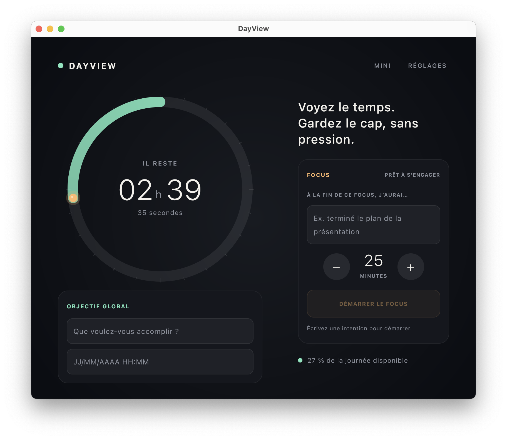

# DayView

DayView makes the time remaining before the end of the day visible. The circle is gradually consumed as the hours pass to reduce *time blindness* without turning time into a source of pressure. The start and end times are configurable and retained between launches.



## Platforms

- Android 7.0 and later
- macOS 13 and later (native desktop application packaged as a `.dmg`)

The interface and business logic are shared using Kotlin Multiplatform and Compose Multiplatform.
The light or dark appearance automatically follows the system theme on Android and macOS.
On Android, a resizable widget displays the ring and remaining time without opening the application. It also shows the global goal and, during a Focus session, the intention and live countdown. A persistent notification tracks the Focus and its pause, with actions to stop or resume the sequence. A “DayView Focus” tile, which can be added from Quick Settings, lets you start the last configured Focus, resume after a pause, or open the active session.
On macOS, DayView remains accessible from the menu bar. Closing its window hides it without stopping the countdown; the menu lets you reopen it or quit the application completely.

Mini-window mode, accessible from the header or menu bar, keeps a compact view of the ring and the day’s countdown above other applications. It also shows the global goal and automatically adds the remaining time and intention while a Focus is in progress.

## Running the project

Prerequisites: JDK 17 or later to run Gradle, and Android SDK 36. The build uses a JDK 21 toolchain, which is downloaded automatically when necessary.

```bash
./gradlew :composeApp:run
```

### Android on a physical device

Enable **Developer options** and then **USB debugging** on the device. Connect it, accept the authorization request, and verify that it appears with the `device` status:

```bash
adb devices
```

To build and directly install the debug version:

```bash
./gradlew :composeApp:installDebug
```

The application can then be launched from the device or the command line:

```bash
adb shell am start -n fr.dayview.app/.MainActivity
```

To produce the APK without installing it:

```bash
./gradlew :composeApp:assembleDebug
```

The APK is generated at `composeApp/build/outputs/apk/debug/composeApp-debug.apk`. It can be installed or updated manually with:

```bash
adb install -r composeApp/build/outputs/apk/debug/composeApp-debug.apk
```

When a Focus is started for the first time, Android requests permission to send notifications and, depending on the system version, access to **Alarms & reminders**. Both permissions are required to receive a precisely timed audible notification when DayView is no longer in the foreground.

You can also open the project in Android Studio and run the `composeApp` configuration.

### macOS

To generate the macOS disk image:

```bash
./gradlew :composeApp:packageDmg
```

The generated volume uses the DayView icon and displays the application next to a shortcut to `/Applications`, allowing it to be installed by drag and drop.

To build the disk image and install it locally in one step, overwriting any previous
copy in `/Applications`:

```bash
./gradlew :composeApp:installMac
```

## Icon

The master SVG, intended as the reference for the Android and macOS variants, can be regenerated without external dependencies:

```bash
python3 scripts/generate_icon_svg.py
```

Two variants are available through `--theme`: `dark` (the default, a luminous mint
ring on a near-black plate) and `light` (a flat warm off-white plate with a deeper
mint ring, matching the light widget palette and shipped as the Android launcher
icon):

```bash
python3 scripts/generate_icon_svg.py --theme light
```

The colors and size can be customized with `--accent`, `--marker`, `--background`, `--surface`, and `--size`. Use `--help` to display all options.

The macOS `.icns` icon, used by the Dock and DMG, is generated from this SVG at all required resolutions:

```bash
./scripts/generate_macos_icon.sh
```

A light `.icns` can be produced from the light SVG by passing source and output paths:

```bash
./scripts/generate_macos_icon.sh artwork/dayview-icon-reference-light.svg artwork/dayview-light.icns
```

## Global goal

A longer-term goal can be entered with a deadline in `DD/MM/YYYY HH:MM` format. Its title and deadline are saved locally, like the day’s start and end times. Its countdown is expressed in working hours and includes only the periods between the daily start and end times.

## Net time

Net time, disabled by default, is configured on the Settings screen. Once enabled and calendar access is granted (read-only), DayView subtracts the periods marked **busy** in the selected calendars from the remaining time and greys them out on the circle. The raw headline figure stays unchanged: net time appears as secondary information below the countdown. Only “busy” events count; “free”, tentative, and all-day events are ignored, and overlapping periods are merged. On platforms with a pointer, hovering over a greyed arc shows the event name and its times. Reading stays strictly local: only the time bounds feed the calculation, the title is used solely for the hover display, and no data is sent over the network. On Android, access relies on the Calendar Provider; on macOS, on EventKit.

## Detours

Detours make visible what pulled you off the path, without losing sight of the goal. A
detour is declared by hand — a motif (“unexpected call”) and an approximate duration —
from the **+ Détour** affordance under the dial; recent motifs are suggested as one-tap
chips. Each episode is drawn as a small colored body threaded on the ring at the time it
happened (size reflects duration, one color per source), with a per-source tally under
the dial and a daily total below the countdown. Hovering a body shows its motif and
times; tapping the tally opens the day’s list, where episodes can be renamed, adjusted,
deleted, or added after the fact. When a goal is set, a soft halo at the center of the
dial keeps it framed as the fixed point of the day. Detours are purely informational —
they never change the countdown or the net time — and are stored locally for the current
day only.

## Focus

The Focus timer lets you commit to a 25-minute block by default, adjustable in five-minute increments. A concrete intention must be entered before starting and remains visible throughout the session. Its deadline and intention are stored locally: the countdown continues when the window is hidden or the application is relaunched. On Android, a system alarm triggers an audible notification at the end even when the application is no longer in the foreground. On macOS, the remaining time is also visible in the menu bar.

During a Focus on macOS, DayView observes only the identifier of the application in the foreground. Four application switches in less than 45 seconds trigger a reminder of the intention. You can also list, on the Settings screen, the applications that count as working toward the goal; while a Focus is active, staying in an application outside that list for more than two minutes triggers the same reminder—catching quiet drift that rapid switching alone would miss. A 30-second grace period and a five-minute interval between reminders prevent repeated interruptions. This detection remains local and never reads window contents.

When on-goal applications are configured, DayView also records the stretches spent in them during a Focus and draws them as accent arcs on the circle, with a “Focus H h MM” total below the countdown. These stretches come purely from the foreground application—brief interruptions under 30 seconds are bridged, and runs shorter than two minutes are ignored—and are stored locally per day, so the arcs survive a relaunch.

If DayView finds a still-active session after the application is relaunched or the Mac wakes up, a resumption ritual brings the intention and remaining time back to the foreground. The user can resume immediately or stop the session.

At the end of a Focus, the session can be closed with one click using “Completed,” “Progressed,” or “Resume later.” The last choice retains the intention for the next session; the other two clear the field for a new task.

## Calculation principle

The day uses the selected start and end times (08:00–18:00 by default) in the device’s local time zone. The circle remains full before the start, is consumed during the defined period, and reaches zero at the end. Daylight saving time changes are handled correctly.

## Sound cues

Sound cues, disabled by default, are configured on the Settings screen. Outside a Focus session, DayView can play a singing bowl at the start of the day, a chime every 30 to 180 minutes—every half hour by default—and a gong at the end. During a Focus, these day cues are suspended in favor of the session cues. Each cue can be disabled separately, previewed, and played at the selected volume. The sounds are synthesized locally and require no audio file or network service.

## License

Copyright 2026 Mickaël Rémond.

DayView is distributed under the Apache 2.0 license. See [LICENSE](LICENSE) for the full text.
