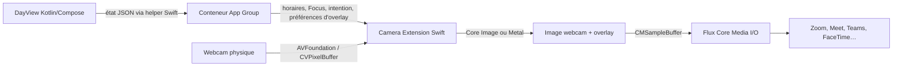

# Caméra virtuelle DayView sur macOS

## Statut

Proposition technique. Cette fonctionnalité n'est pas encore implémentée.

## Objectif

Fournir une caméra sélectionnable sous le nom **DayView Camera** dans les applications de visioconférence. Son image combine :

- le flux de la webcam choisie par l'utilisateur ;
- l'anneau de progression de la journée ;
- le temps restant ;
- l'intention et le temps restant du Focus lorsqu'une session est active.

Le traitement reste entièrement local. La fonctionnalité ne publie pas le son : l'utilisateur continue de sélectionner son microphone habituel dans l'application de visioconférence.

## Expérience utilisateur visée

Une section **Caméra virtuelle** dans les réglages macOS permettrait de :

1. installer ou activer l'extension système lors de la première utilisation ;
2. choisir la webcam source ;
3. activer ou désactiver l'overlay ;
4. choisir son coin, sa taille et son opacité ;
5. afficher un aperçu ;
6. sélectionner ensuite **DayView Camera** dans Zoom, Meet, Teams, FaceTime ou toute autre application compatible.

L'overlay devrait rester discret : petit anneau dans un coin, durée au centre et intention sur une ou deux lignes à côté. Par défaut, l'intention n'est affichée que pendant un Focus actif. Une option doit permettre de masquer rapidement l'overlay sans désinstaller la caméra.

## Choix technologique

Utiliser une **Camera Extension Core Media I/O**. Cette API, disponible depuis macOS 12.3, est la solution moderne recommandée par Apple pour publier une caméra logicielle. Elle est compatible avec la cible macOS 13 minimale de DayView.

Références Apple :

- [Creating a camera extension with Core Media I/O](https://developer.apple.com/documentation/CoreMediaIO/creating-a-camera-extension-with-core-media-i-o)
- [Core Media I/O](https://developer.apple.com/documentation/coremediaio)
- [Setting up a capture session](https://developer.apple.com/documentation/avfoundation/setting-up-a-capture-session)

Les anciens plug-ins DAL ne doivent pas être utilisés. Ils sont moins sûrs, plus difficiles à distribuer et incompatibles avec certaines applications qui imposent la validation de bibliothèque.

## Architecture proposée



La fonctionnalité nécessite trois éléments :

### 1. Application DayView existante

L'application Kotlin/Compose reste la source de vérité pour :

- les heures de début et de fin de journée ;
- l'affichage éventuel des secondes ;
- la durée et l'échéance du Focus ;
- l'intention ;
- les réglages visuels de la caméra.

Elle pilote un petit helper Swift selon le même principe que `MacFocusStatusHelper.swift`. Le helper écrit un instantané d'état dans le conteneur partagé de l'App Group et émet une notification interprocessus après chaque modification.

Les préférences Java actuellement utilisées par `DesktopDayPreferences` ne doivent pas être lues directement par l'extension. Leur emplacement et leur format ne constituent pas un contrat stable et une extension sandboxée n'y a pas naturellement accès.

### 2. Hôte natif macOS

Un composant Swift signé porte les capacités nécessaires et soumet la demande d'activation avec `OSSystemExtensionManager`. Il fournit également :

- l'état d'installation de l'extension ;
- le choix de la webcam ;
- les demandes d'autorisation ;
- un diagnostic simple en cas d'indisponibilité.

Pour une première version, la solution la moins fragile consiste à livrer un petit **DayView Camera.app** natif à côté de DayView dans le DMG. Il embarque la Camera Extension et peut être lancé depuis les réglages DayView. Une intégration dans le même bundle que l'application jpackage pourra être étudiée ensuite, mais elle impose de reconstruire et signer précisément toute la hiérarchie du bundle après le packaging Compose.

À terme, un hôte natif unique pourrait envelopper le runtime JVM et l'extension pour offrir une seule application visible. Cette migration n'est pas requise pour valider la fonctionnalité.

### 3. Camera Extension

L'extension Swift publie un provider, un device et un stream Core Media I/O :

- `CMIOExtensionProvider` représente DayView ;
- `CMIOExtensionDevice` publie **DayView Camera** ;
- `CMIOExtensionStream` produit les images, par exemple en 1280 × 720 à 30 images par seconde.

Elle ouvre la webcam physique avec `AVCaptureSession` et récupère les images avec `AVCaptureVideoDataOutput`. La caméra virtuelle DayView doit être explicitement exclue de la liste des sources afin d'éviter une boucle de capture.

Chaque image suit ce pipeline :

1. réception d'un `CVPixelBuffer` de la webcam ;
2. correction de l'orientation et application du cadrage choisi ;
3. calcul local de la progression à partir des horaires et de l'heure courante ;
4. rendu de l'anneau, du temps et de l'intention avec Core Image ou Metal ;
5. conversion en `CMSampleBuffer` horodaté ;
6. envoi au stream Core Media I/O.

Le calcul du temps doit être porté dans une petite implémentation Swift testable avec les mêmes cas que `DayProgressTest` et `PomodoroTest`. L'état partagé contient les échéances et les réglages, pas une image d'overlay recalculée chaque seconde.

## État partagé

Un fichier JSON versionné et remplacé atomiquement dans l'App Group est suffisant pour la première version :

```json
{
  "schemaVersion": 1,
  "updatedAtMillis": 0,
  "day": {
    "startMinutes": 480,
    "endMinutes": 1080,
    "showSeconds": true
  },
  "focus": {
    "endMillis": null,
    "intention": ""
  },
  "camera": {
    "enabled": true,
    "sourceDeviceId": null,
    "position": "bottomLeading",
    "scale": 1.0,
    "opacity": 0.92,
    "mirrorSource": false
  }
}
```

Règles d'échange :

- écriture dans un fichier temporaire puis renommage atomique ;
- champ `schemaVersion` obligatoire ;
- valeurs manquantes remplacées par des valeurs par défaut sûres ;
- intention limitée à la longueur déjà acceptée par DayView ;
- notification Darwin après écriture et relecture périodique de secours ;
- conservation du dernier état valide en cas de lecture partielle ou corrompue.

## Permissions, signature et installation

L'hôte et l'extension doivent partager un App Group. L'hôte nécessite notamment la capacité d'installation de System Extension. L'extension est sandboxée et nécessite l'accès à la caméra si elle capture une autre caméra.

Les fichiers exacts d'entitlements seront générés par le projet Xcode, mais ils devront couvrir au minimum :

- `com.apple.developer.system-extension.install` pour l'hôte ;
- `com.apple.security.application-groups` pour l'hôte et l'extension ;
- `com.apple.security.device.camera` pour le processus qui capture la webcam ;
- une description d'usage caméra compréhensible par l'utilisateur.

L'application doit être installée dans `/Applications` pour activer l'extension. macOS demande une validation explicite lors de la première activation ; selon la configuration du Mac, des droits administrateur peuvent être nécessaires. Le produit doit expliquer cette étape et afficher l'état réel de l'activation.

La distribution impose :

- un identifiant stable pour l'hôte et l'extension ;
- un certificat Developer ID ou une distribution Mac App Store ;
- la signature de l'extension avant celle de l'application qui l'embarque ;
- la signature finale du DMG ;
- la notarisation et l'agrafage du ticket.

## Packaging dans ce dépôt

Ajouter un projet Xcode dédié, par exemple :

```text
macosCamera/
├── DayViewCamera.xcodeproj
├── Host/
├── CameraExtension/
├── Shared/
└── Tests/
```

Gradle peut orchestrer `xcodebuild`, mais Xcode doit rester responsable de la compilation, des entitlements et de la signature du bundle natif. Le flux de packaging proposé est :

1. compiler et tester le code Kotlin ;
2. construire `DayView Camera.app` et son extension avec `xcodebuild archive` ;
3. produire l'application Compose avec `createDistributable` ;
4. placer les deux applications dans le DMG ;
5. signer, notariser et vérifier le résultat installé.

Les secrets de signature et le Team ID ne doivent pas être inscrits dans le dépôt. Ils sont fournis par la configuration locale ou la CI.

## Résilience et cas dégradés

L'extension doit continuer à fournir une image valide dans les situations suivantes :

- **webcam absente ou occupée** : mire DayView avec un message court, sans boucle de redémarrage agressive ;
- **DayView arrêté** : dernier état valide pendant une courte période, puis overlay neutre ;
- **Focus terminé** : disparition automatique de l'intention ;
- **changement de caméra** : bascule contrôlée, avec une image de transition ;
- **format demandé non pris en charge** : conversion vers le format publié par le stream ;
- **client déconnecté** : arrêt de la capture pour économiser la caméra, le CPU et la batterie ;
- **mise en veille ou réveil** : reconstruction de la session de capture si nécessaire.

La prévisualisation locale peut être miroir pour correspondre aux habitudes de visioconférence, mais le flux envoyé ne doit pas être miroir par défaut. Ce choix doit être explicite dans les réglages.

## Performance cible

La première version cible 720p à 30 images par seconde. Elle doit :

- éviter toute conversion CPU complète par image ;
- réutiliser les pools de `CVPixelBuffer` ;
- pré-rendre les éléments textuels et ne les régénérer que lorsqu'ils changent ;
- utiliser Core Image ou Metal sur le GPU ;
- suspendre la session lorsqu'aucun client ne consomme la caméra ;
- mesurer les images perdues, sans journaliser le contenu vidéo ni l'intention.

Le 1080p peut être ajouté après mesure sur Mac Intel et Apple Silicon.

## Sécurité et confidentialité

- aucune image ne quitte le Mac ;
- aucune image n'est enregistrée sur disque ;
- aucune télémétrie ne contient l'intention ;
- la caméra n'est ouverte que lorsqu'un client utilise **DayView Camera** ou lorsque l'aperçu est explicitement visible ;
- un indicateur dans DayView montre que la caméra virtuelle est en cours d'utilisation ;
- l'utilisateur peut couper immédiatement l'overlay ou désactiver l'extension.

## Plan de livraison

### Phase 0 — Validation avec OBS

Créer une vue d'overlay transparente et la composer avec la webcam dans OBS Virtual Camera. Cette étape permet de valider la lisibilité, les dimensions et les options d'affichage, mais ne constitue pas l'architecture finale.

### Phase 1 — Prototype natif

- projet Xcode avec le template Camera Extension ;
- image de test publiée comme **DayView Camera** ;
- capture de la webcam physique ;
- overlay statique ;
- installation locale depuis `/Applications`.

### Phase 2 — Intégration DayView

- helper de synchronisation vers l'App Group ;
- anneau et calculs dynamiques ;
- intention Focus ;
- sélection de la caméra et aperçu ;
- gestion des permissions et erreurs.

### Phase 3 — Distribution

- packaging dans le DMG ;
- signature et notarisation ;
- tests Zoom, Meet, Teams, FaceTime, QuickTime et Photo Booth ;
- tests Intel et Apple Silicon ;
- documentation d'installation et de désinstallation.

## Stratégie de test

### Tests unitaires Swift

- calcul de progression avant, pendant et après la journée ;
- passage de minuit et changement d'heure ;
- états Focus inactif, actif et terminé ;
- migration et validation du JSON ;
- placement de l'overlay pour chaque coin et chaque ratio d'image.

### Tests d'intégration

- activation, mise à jour et désactivation de l'extension ;
- apparition de **DayView Camera** dans les clients ;
- ouverture et libération de la webcam source ;
- propagation d'une nouvelle intention sans relancer le stream ;
- comportement après veille, déconnexion caméra et relance de DayView.

### Validation visuelle et performance

- absence de texte coupé en 16:9 et 4:3 ;
- contraste sur fonds clairs et sombres ;
- cadence stable à 720p30 ;
- consommation CPU/GPU et mémoire ;
- latence ajoutée par la composition.

## Risques principaux

| Risque | Réponse proposée |
| --- | --- |
| Complexité de signature d'une System Extension dans le bundle Compose | Livrer d'abord un hôte natif séparé dans le même DMG |
| État Kotlin inaccessible depuis le sandbox de l'extension | Helper Swift et App Group avec schéma JSON versionné |
| Webcam déjà utilisée ou refus d'autorisation | État dégradé explicite et reprise contrôlée |
| Boucle en sélectionnant la caméra virtuelle comme source | Exclure l'identifiant du device DayView |
| Overlay illisible ou trop intrusif | Aperçu, positions, échelle, opacité et masquage rapide |
| Coût GPU ou latence | 720p30 initial, pools de buffers et mesure avant 1080p |
| Différences entre clients de visioconférence | Matrice de tests avec applications système, navigateur et clients natifs |

## Critères d'acceptation de la première version distribuable

- **DayView Camera** apparaît après une installation guidée sur macOS 13 ou ultérieur ;
- elle compose la webcam sélectionnée avec l'anneau DayView ;
- le temps et l'intention se mettent à jour sans redémarrer l'appel ;
- l'intention disparaît à la fin du Focus ;
- aucune image n'est enregistrée ou envoyée à un service DayView ;
- la caméra physique est libérée lorsqu'aucun client n'utilise le flux ;
- le DMG signé et notarisé s'installe sans procédure de sécurité non standard ;
- la fonctionnalité fonctionne au minimum dans FaceTime, QuickTime, Zoom, Meet et Teams.
