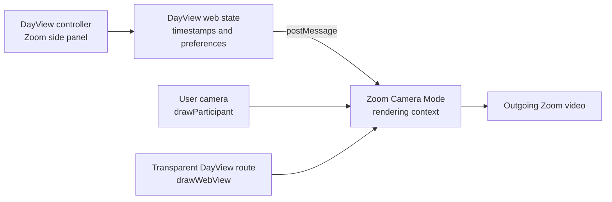

# DayView Zoom Camera Mode Plan

## Status

Proposed feature. This functionality is not yet implemented.

## Objective

Provide a Zoom App that can place a small, live DayView overlay on the user's own
outgoing video. Other meeting participants see the overlay as part of the normal
video stream and do not need to install DayView.

The first version is intended for development and private testing. Publishing the
app in the Zoom App Marketplace is a separate phase.

This integration is specific to Zoom. It is distinct from the system-wide macOS
virtual camera described in [macos-virtual-camera.md](macos-virtual-camera.md):

- Zoom Camera Mode does not require a macOS Camera Extension or a virtual-camera
  driver;
- the feature runs from a hosted web application inside the Zoom client;
- it affects only the user's own Zoom video stream;
- the system-wide virtual camera remains the option for Meet, Teams, FaceTime,
  and other camera consumers.

## Target Experience

DayView appears in the Zoom Apps side panel. The user can view the private
DayView interface there and explicitly select **Show on my video**.

When enabled, the outgoing video contains a discreet overlay such as:

```text
◔  Focus · 18:42
```

Outside a Focus session, the overlay can instead show the day ring and remaining
working time. The user can choose between:

- ring only;
- ring and remaining time;
- Focus countdown;
- Focus countdown and intention.

The Focus intention is hidden by default because it may contain personal or
professional information. The side panel remains private even when the video
overlay is disabled.

The interface must always make the sharing state obvious:

- **Private**: DayView is visible only in the user's side panel;
- **Visible on video**: all recipients of the user's video can see the overlay;
- **Camera off**: the overlay is not being transmitted.

Closing Camera Mode immediately restores the ordinary camera stream.

## Zoom Platform Model

Zoom Apps are hosted HTTPS web applications displayed inside the Zoom client.
Camera Mode is part of the Zoom Apps Layers API. It creates an off-screen camera
rendering context in which the app composes the current participant's camera and
a web view containing the DayView overlay.

The development setup requires:

- a Zoom account with developer access;
- a user-managed General App configured in the Zoom App Marketplace developer
  portal;
- the Meetings surface and the `zoomapp:inmeeting` scope;
- Zoom Apps SDK and the Layers/Camera Mode APIs enabled in the app configuration;
- a Zoom client supporting Camera Mode (Zoom documents version 5.13.1 or later);
- an HTTPS Home URL reachable by the Zoom client;
- all required OWASP response headers on HTML responses;
- every frontend, API, asset, and WebSocket host included in the Zoom domain
  allow list.

The development app can be added to the owner's account from **Local Test**. It
does not need Marketplace approval for this private use. Other people in a test
meeting do not need the development app merely to see the outgoing overlay.
They would need access to the app only if they must control or run DayView
themselves.

References:

- [Zoom Camera Mode](https://developers.zoom.us/docs/zoom-apps/guides/camera-mode/)
- [Zoom Apps Layers API](https://developers.zoom.us/docs/zoom-apps/guides/layers-api/)
- [Creating a Zoom App](https://developers.zoom.us/docs/zoom-apps/create/)
- [Required OWASP headers](https://developers.zoom.us/docs/zoom-apps/security/owasp/)

## Scope of the Development Prototype

Included:

- a Zoom side-panel view with the DayView day ring and Focus controls;
- an explicit action to start and stop Camera Mode;
- composition of the user's camera with a transparent DayView overlay;
- live day and Focus countdowns calculated from timestamps;
- overlay position, scale, and opacity controls;
- an exact preview before sharing;
- optional Focus intention sharing, disabled by default;
- local persistence for prototype settings;
- private testing from the developer Zoom account.

Excluded from the first prototype:

- Marketplace publication;
- installation by arbitrary Zoom users;
- shared or host-controlled Focus sessions;
- Zoom Team Chat presence updates;
- synchronization with the Android and macOS DayView applications;
- analytics, recording, or storage of video frames;
- support for non-Zoom conferencing applications.

## Proposed Architecture



The Zoom integration should be a separate TypeScript web application. A
suggested repository layout is:

```text
zoomApp/
├── src/
│   ├── controller/       # private side-panel UI
│   ├── camera/           # transparent camera renderer
│   ├── dayview/          # timing calculations and models
│   └── zoom/             # Zoom Apps SDK adapter
├── server/               # HTTPS headers and development server
└── tests/
```

TypeScript is preferred for the first version because Zoom Apps use a JavaScript
SDK and run in embedded web views. The relevant algorithms in `DayProgress.kt`,
`Pomodoro.kt`, and `GlobalGoal.kt` are small enough to port with matching test
vectors. Adding a Kotlin/Wasm target can be reconsidered after the Zoom proof of
concept, but it should not be required to validate Camera Mode.

### Controller Instance

The ordinary Zoom App instance runs in the meeting side panel. It owns:

- the DayView settings and Focus actions;
- the preview and privacy controls;
- the explicit Camera Mode start/stop action;
- the state sent to the camera renderer.

It calls `zoomSdk.config()` with only the capabilities used by the prototype,
including the rendering-context, participant, web-view, messaging, and media
change APIs. It then starts Camera Mode with
`runRenderingContext({ view: "camera" })`.

### Camera Renderer Instance

Camera Mode launches a separate app instance in an off-screen rendering context.
The renderer should use a dedicated route, for example `/camera`, with a
transparent background and no controls.

After the running context reports `inCamera`, it:

1. draws the current participant camera across the render target with
   `drawParticipant`;
2. draws the transparent DayView web view above it with `drawWebView`;
3. receives state updates from the controller with `postMessage`/`onMessage`;
4. recalculates the displayed countdown locally from the shared end timestamp;
5. redraws layout when Zoom reports a relevant media change.

The controller sends deadlines and settings, not a message every second. This
keeps the instances synchronized without unnecessary traffic.

## State Model

The prototype can use a small versioned payload:

```ts
type ZoomCameraState = {
  schemaVersion: 1
  updatedAtMillis: number
  day: {
    startMinutes: number
    endMinutes: number
    showSeconds: boolean
  }
  focus: {
    endMillis: number | null
    intention: string
  }
  overlay: {
    enabled: boolean
    mode: "day" | "focus" | "automatic"
    position: "top-left" | "top-right" | "bottom-left" | "bottom-right"
    scale: number
    opacity: number
    shareIntention: boolean
  }
}
```

For the prototype, settings may be saved in browser storage. This storage is not
the same as the current Android `SharedPreferences` or desktop Java Preferences,
so changes will not automatically propagate between products.

Later, the remote synchronization service proposed in
[device-sync-plan.md](device-sync-plan.md) should become the source of shared
DayView state. The camera renderer should still receive a minimal snapshot from
the controller and should never receive authentication secrets.

## Privacy and Security

Camera sharing must be opt-in each time it is activated. DayView must not start
Camera Mode merely because a Focus session starts.

Privacy defaults:

- Camera Mode disabled;
- intention sharing disabled;
- global goal never shown on video in the first version;
- neutral countdown text when no sharing choice has been made;
- visible in-panel indicator while Camera Mode is active;
- one-click **Remove from video** action.

The application must not capture, record, upload, analyze, or log camera frames.
Composition is performed by Zoom's local rendering context. Logs must exclude
the Focus intention, meeting identifiers, Zoom context headers, OAuth tokens,
and app credentials.

The hosted application must:

- use TLS;
- return Zoom's required security headers on every HTML response;
- keep development and production client secrets on the server only;
- validate the encrypted Zoom app context on the server if it is used for user
  identity or authorization;
- request the minimum Zoom capabilities and OAuth scopes.

## Development Plan

### Phase 1 — Static Camera Mode Validation

- create the General App and configure a development Home URL;
- scaffold the TypeScript controller and camera routes;
- configure the minimum Zoom Apps SDK capabilities;
- enter and leave Camera Mode from an explicit button;
- draw the user camera and a static DayView badge;
- verify that an external meeting participant sees the composed video without
  installing the app.

This phase validates the critical platform assumption before implementing the
full interface.

### Phase 2 — Live DayView Overlay

- port day-progress and Pomodoro calculations with matching unit tests;
- render the ring and countdown on a transparent camera route;
- send state changes between controller and renderer;
- add automatic day/Focus display selection;
- handle starting, stopping, expiry, and Focus closure;
- add position, scale, opacity, and preview controls.

### Phase 3 — Resilience and Privacy

- add explicit sharing indicators and intention consent;
- recover cleanly if the camera rendering package is not ready;
- handle camera toggles and device changes through Zoom media events;
- stop rendering when the user closes Camera Mode or leaves the meeting;
- validate CSP, allowed domains, headers, and absence of sensitive logs;
- test reconnection, client restart, and a restored Focus deadline.

### Phase 4 — DayView Synchronization

- connect the Zoom web app to the future DayView sync service;
- associate Zoom authorization with a DayView account;
- synchronize settings and Focus deadlines rather than per-second values;
- preserve standalone local operation when synchronization is unavailable;
- resolve concurrent Focus actions according to the synchronization model.

### Phase 5 — Optional Distribution

- prepare privacy policy, terms, support documentation, and Marketplace listing;
- replace development credentials and URLs with production values;
- document all data handling and requested scopes;
- run functionality, accessibility, and security checks;
- submit the app for Zoom review;
- enable installation outside the developer account only after approval.

## Testing Strategy

### Unit Tests

- day progress before, during, and after configured hours;
- Focus inactive, active, expired, and closed states;
- second/minute display boundaries;
- validation and migration of camera state payloads;
- layout placement at common 16:9 and 4:3 render sizes;
- privacy filtering when intention sharing is disabled.

### Zoom Integration Tests

- start and stop Camera Mode repeatedly;
- verify the private panel never appears in outgoing video;
- verify the overlay is visible to another meeting participant;
- verify that the other participant does not need to install DayView;
- switch cameras, turn video off/on, and change HD/original-ratio settings;
- start, stop, expire, and close a Focus while Camera Mode is active;
- leave the meeting while the renderer is active;
- test slow initialization of Zoom's camera rendering environment;
- confirm that closing Camera Mode restores the unmodified camera.

### Visual and Performance Tests

- readability in gallery view, speaker view, and a small participant tile;
- contrast over light, dark, and visually busy backgrounds;
- no clipping in supported render-target sizes;
- stable animation without forcing full-page rendering every second;
- acceptable CPU and memory use during a one-hour meeting;
- correct behavior when the Zoom client does not support a requested API.

## Main Risks

| Risk | Proposed response |
| --- | --- |
| Camera Mode initialization is slow or its rendering package is unavailable | Wait for `inCamera`/renderer readiness and present a recoverable error |
| The intention reveals confidential information | Hide it by default, show an exact preview, and require explicit consent |
| The overlay becomes unreadable in small video tiles | Use a compact ring and short countdown; test gallery-view sizes |
| Zoom web state diverges from native DayView state | Treat the prototype as standalone, then use the planned sync service |
| Unsupported API or older Zoom client | Detect supported APIs and keep the private side-panel experience available |
| Camera renderer and controller lose synchronization | Send complete versioned snapshots and refresh after renderer readiness |
| Marketplace review expands the initial scope | Keep private testing independent from the later distribution phase |

## Acceptance Criteria for the Development Prototype

- the private app can be added from Local Test without Marketplace publication;
- DayView opens in the Zoom meeting side panel;
- the user explicitly enables and disables Camera Mode;
- the user's normal camera and DayView overlay are combined in the outgoing
  video;
- another participant sees the live overlay without installing DayView;
- the ring and countdown update correctly throughout a Focus session;
- the Focus intention is not transmitted unless explicitly enabled;
- no video frame or intention is stored, uploaded, or logged;
- closing Camera Mode restores the ordinary camera stream;
- a Camera Mode failure does not break the private DayView timer.
